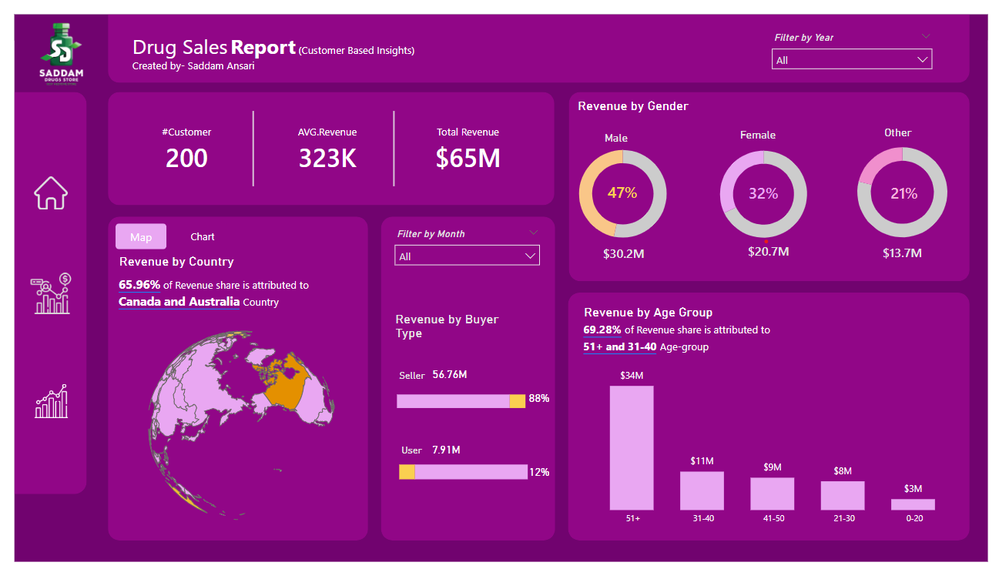
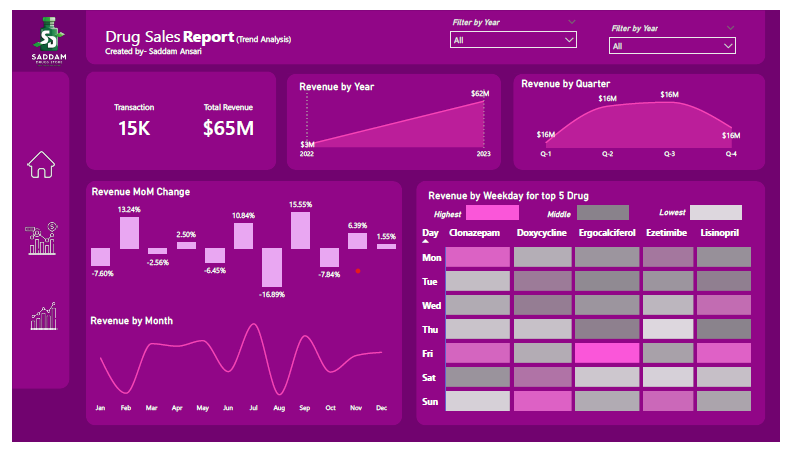

# Medicine Sales Analysis

## Created & Analyzed by Prashant Bhausaheb Gardhe  
🎓 Final-Year IT Student | Aspiring Data Analyst  
🔗 LinkedIn: [https://www.linkedin.com/in/prashant-gardhe](https://www.linkedin.com/in/prashant-gardhe-012953325/)  

---

## Project Objective

The primary objective of this project is to design and develop a **comprehensive and interactive Power BI dashboard** to analyze **medicine sales data for the year 2023**.

This project was undertaken to help stakeholders gain a clear understanding of overall sales performance, customer behavior, and revenue trends. By converting raw transactional data into meaningful insights, the dashboard supports **data-driven decision-making and strategic planning**.

---

## Dataset Overview

The analysis is performed using **three CSV datasets**, each representing a key business entity:

### 1. Customer Table
Contains demographic and background information of customers.

| Column | Data Type | Description |
|------|----------|-------------|
| CustomerID | Integer | Unique customer identifier |
| FirstName | String | Customer first name |
| LastName | String | Customer last name |
| Age | Integer | Customer age |
| Gender | String | Gender |
| Country | String | Customer country |
| OtherCustomerInfo | String | Additional customer details |

---

### 2. Drugs Lookup Table
Provides information related to medicines available for sale.

| Column | Data Type | Description |
|------|----------|-------------|
| DrugID | Integer | Unique drug identifier |
| RegulatoryComplianceID | Integer | Compliance category ID |
| DrugName | String | Name of the drug |
| UnitSalesPrice | Float | Price per unit |
| CostOfProduction | Float | Production cost |
| Treats | String | Medical purpose |

---

### 3. Sales Transactions Table
Stores individual sales transaction details.

| Column | Data Type | Description |
|------|----------|-------------|
| SaleID | Integer | Unique sale identifier |
| DrugID | Integer | Drug sold |
| CustomerID | Integer | Purchasing customer |
| UnitsSold | Integer | Quantity sold |
| SaleDate | Date | Date of sale |
| BuyerType | String | Seller or User |

---
---

## Detailed Insights Explanation

### Page One: Top / Bottom Performance Analysis

This page provides a comprehensive overview of the overall sales performance, designed to give stakeholders a clear and detailed understanding of key metrics and trends. The page is structured as follows:

Top KPIs Section:
At the top of the page, five key performance indicators (KPIs) are displayed. These KPIs are dynamically filtered based on the selected month, providing a quick snapshot of the following metrics:

Quantity Sold: Comparison between the current month and the previous month, along with the growth percentage.
Cost of Goods Sold (COGS): Monthly comparison and growth percentage.
Revenue: Monthly comparison and growth percentage.
Profit: Monthly comparison and growth percentage.
These KPIs help in monitoring monthly performance and identifying trends at a glance.

Top and Bottom Drugs Bar Chart:
Below the KPIs, a bar chart is presented to display the top and bottom performing drugs. The drugs can be viewed based on various metrics, such as:

Transactions: Number of transactions for each drug.
Profit: Profit generated by each drug.
Revenue: Revenue generated by each drug.
Units Sold: Number of units sold for each drug.
This chart helps in identifying which drugs are performing well and which ones need attention.

Top and Bottom Customers Bar Chart:
Similar to the drugs chart, there is a bar chart for customers, showing the top and bottom customers based on:

Transactions: Number of transactions made by each customer.
Profit: Profit generated from each customer.
Revenue: Revenue generated from each customer.
Units Sold: Number of units sold to each customer.
This analysis helps in understanding customer behavior and identifying key customer segments.

For a detailed understanding and interactive experience, visit the live dashboard.

### Page Two: Customer & Demographic Insights

This page provides in-depth insights into customer demographics and their contribution to sales and revenue. The layout and visualizations are designed to help stakeholders understand customer behavior and demographic trends effectively. The key elements of this page are:

Key Performance Indicators (KPIs):
Important KPIs are displayed at the top, offering a quick overview of customer-related metrics:

Total Customers: The total number of unique customers.
Average Revenue per Customer: The average revenue generated per customer.
Total Revenue: The total revenue generated.
Sales by Country Map Chart:
A map chart is provided to display sales distribution by country.
Users can interact with this chart to view detailed sales data for each country by using the provided bookmarks.
Revenue by Gender Doughnut Chart:
This chart shows the percentage of revenue contributed by each gender.
It helps in understanding gender-wise revenue distribution and identifying key customer segments.
Revenue by Buyer Type:
A visual representation of revenue generated from different types of buyers (Sellers vs. Users).
This helps in determining the contribution of each buyer type to the overall revenue.
Revenue by Age Group:
A visualization that displays revenue distribution across different age groups.
This provides insights into which age groups are the most profitable and helps in targeted marketing efforts.

### Page Three: Trend Analysis

The third page of the dashboard focuses on analyzing various sales and revenue trends over different time periods. This page is essential for understanding how sales performance changes over time and identifying patterns that can inform future strategies. The key components of this page are:

Key Performance Indicator (KPI):
Total Transactions: A KPI at the top of the page showing the total number of transactions.
Revenue by Year Line Chart:
A line chart that displays the revenue on a yearly basis.
This visualization helps in understanding the annual revenue trends.
Revenue by Quarter Line Chart:
Another line chart that shows the revenue broken down by quarters.
It provides insights into quarterly revenue performance, helping to identify seasonal trends.
Revenue by Month Line Chart:
This line chart illustrates the monthly revenue.
It helps in tracking the revenue performance on a month-to-month basis.
Monthly Growth Percentage:
A visual representation of the percentage growth from the previous month to the current month.
This metric is crucial for understanding the monthly growth rate and identifying any significant changes in revenue.
Weekly Trend by Medicine Sales:
This visualization shows the sales trends of the top 5 drugs on a weekly (day-wise) basis.
It helps in identifying which medicines are sold the most on specific days of the week.
For a detailed understanding and interactive experience, please visit the live dashboard.

---

## Tools & Technologies Used

- **Power BI**
- **CSV Dataset**
- **DAX Measures**
- **Power Query**

---

## Key Learnings

- End-to-end Power BI dashboard development
- Data modeling and relationship handling
- KPI creation using DAX
- Business-oriented data storytelling

---

## About Me

I am **Prashant Bhausaheb Gardhe**, a **final-year Information Technology student** passionate about **Data Analytics, Power BI, and Business Intelligence**.

I am actively seeking **internship or entry-level roles** in:
- Data Analytics
- Business Intelligence
- Power BI Development

📍 Location: India  

---

### Created & Presented By  
**Prashant Bhausaheb Gardhe**  
Aspiring Data Analyst  
🔗 LinkedIn: [https://www.linkedin.com/in/prashant-gardhe](https://www.linkedin.com/in/prashant-gardhe-012953325/)  
